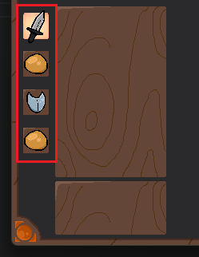

# BugGame

A trading card roguelike based around bugs and the theme of "Size Matters".

Made with love, by the [CS Club](https://ccsf-cs.club/) at City College of San Francisco, for [this game jam](https://itch.io/jam/godot-jam-2024).

# Contributors

(Vena first, then alphabetical)
| Person        | Contribution |
| ------------- | ------------ |
| Vena          | Lead Game Developer, game logic code, Tabletop/UI Art |
| Citrine       | Math for card rotation |
| [@GabeMillikan](https://github.com/GabeMillikan) | Card hovering, defense result indicator, deck inspection popup, debugging, wrote the readme |
| Gev           | Credits + Card Art |
| Jason         | Ui Display (Hp Dynamic Updates) + Design |
| Jesse         | Technical Art Lead + UI/UX Display (Hand Spread) |
| John          | UI/UX Interaction (Card Hand Clicks) + Ideas |
| Kyle          | Music tracks, Main Menu and Angel Boss |
| Leo           | Music for Sanguine Mama |
| Niko          | Card Art |
| Pink          | Implimenting Audio and UI Code |
| Val           | Card Art |

# Running the Game

- **Online**: the game is hosted at https://vena-the-wackadoodle.itch.io/bug-game
- **Locally**: clone the repository and open the folder using [Godot 4.2](https://godotengine.org/download/archive/4.2-stable/)

# How to Play

The core loop of the game consists of 4 phases. One "turn" consists of completing your 4 phases, then the boss will attack you, and you return to phase 1. The current phase is highlighted as one of these four icons in the bottom left:

### 1. Attack
You pick the card that you want to attack with. You may only pick a card which you will be able to "pay for" in the following phase. Consider this card:

It deals 4 damage (bottom left) but costs 4 big mana and 2 small mana to cast (top right). The game will only allow you to use this card if you have enough mana in your hand (something you'll deal with in the next phase). If you don't have any usable cards, you must "pass" the attack phase:

### 2. Pitch Attack
After you've selected a card in the attack phase, you now must _pitch_ for it (to pay for the mana cost). Remember, the bomber beetle from above requires 4 big mana and 2 small mana. So, we will need to pay with at least 4 big pitch and 2 small pitch. You must sacrifice some of your cards in order to pay for the attack. Each card has a big and small pitch value, consider these cards:

The Moth has 3 big pitch and 3 small pitch (top left). Click on this card to pitch it. Now, you only need one more big pitch and you have one extra small pitch (which won't go to waste). To get that additional big pitch, use the Fire Fly (worth 2 big pitch and 0 small pitch). Let's see this in action!

<video controls src=".github/readme-images/phase1-2demo.mp4" title="Phases 1 and 2 Demo" height="250px"></video>

We dealt 4 damage to the boss, nice! You'll also notice that we're back at phase 1. This is because those extra left-over pitch (displayed in the top right) mean that we still have enough pitch to cast another attack card! If you want to, go ahead. Otherwise, if you want to hold on to your cards, pass. 

### 3. Defense

At the beginning of the defense phase, you will draw new cards from your deck until you have 5 cards in your hand. (You only draw new cards once per turn, even though phase 3 might occur multiple times in a turn.)

The goal of defense is to decrease the amount of damage the boss will do. The boss's attack card is displayed at the top. Each card has a defense value, consider this card:

This card will block up to 4 damage (bottom right). It requires 2 big mana and 4 small mana (top right). Remember, cards used to defend cannot be used for attack in the next turn! If you don't want to defend, and think you can just tank the damage, pass.

### 4. Pitch Defense

Nearly identical to phase 2. You'll need to pay for the defense card, and can play multiple cards if you have enough pitch. After completing your defense, the boss will attack. Underneath your health, it tells you how much damage the boss dealt and how much you defended. In this screenshot, the boss dealt 4 damage but I defended 4 damage, so I'm still at full health!

Now, you return to phase 1 and repeat until you or the boss dies. 

After defeating the boss, you can open a card pack to expand and improve your deck! Then, you move on to the next boss until you eventually complete the game.

### Have fun, and thanks for playing!

